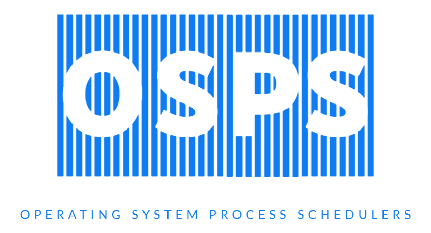
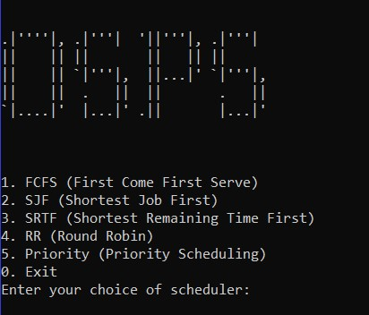
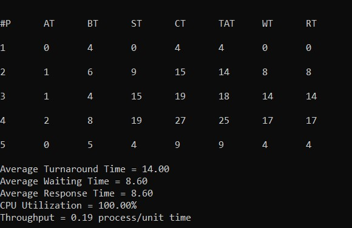

# OSPS

Operating System Process Schedulers

<div align="center">

</div>

     

## Quick Start

<div align="center">

</div>

### Solution

<div align="center">

</div>

## Build

### Without Make

Use this script to build the executable file.

```bash
g++ -std=c++17 -I ./include/ src/FCFS/fcfs.cpp src/SJF/sjf.cpp src/SRTF/srtf.cpp src/RR/rr.cpp src/PS/ps.cpp src/osps.cpp -o ./bin/osps.exe
```

Run the executable file using:

```bash
./bin/osps.exe
```

### Using Make

Build the executable file using:

```bash
make build
```

Run the executable file using:

```bash
make run
```

Just use `make` to build & run the executable file.

Use `make clean` to remove the executable file.

---

|Short Form|Meaning|
|--|--|
|AT|Arrival Time of the process|
|BT|Burst Time of the process|
|ST|Start Time of the process|
|CT|Completion Time of the process|
|TAT|Turnaround Time of the process|
|WT|Waiting Time of the process|
|RT|Response Time of the process|

---

|Formulas used|
|--|
|TAT = CT - AT|
|WT = TAT - BT|
|RT = ST - AT|
